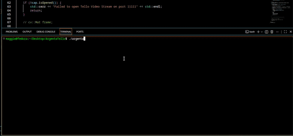

# ArgentaTello

This is an exploratory project to interface with the programmable [DJI Tello drone](https://store.dji.com/pt/product/tello), making it execute pre-planned flight paths alongside real-time video processing. The main learning outcomes were working with a hardware API and basic socket communication, dealing with concurrency/threads, and implementing live visual feedback using OpenCV.

   

## Prerequisites

- Linux or macOs (POSIX)

- C++17 compiler (g++) and build system (make)

- OpenCV 4.x
```bash
pkg-config --modversion opencv4 # verify the installation 
```

## Build

### Makefile

Make sure you're in the root directory.

**Build and run**
```bash
make
./argenta
```

**Remove**
```bash
make clean
```

## Configuration

1. Download this repository, the YOLOv8 model (releases here: https://github.com/ultralytics/assets/releases) to the correct directory and build

```bash
curl -L -o model/yolov8n.onnx "https://github.com/ultralytics/assets/releases/download/v8.4.0/yolov8n.onnx"
make
```

- Make sure you've **allowed UDP traffic** on **ports 8889** and **11111** in your device

2. Turn the drone on, wait a few seconds, and **ensure you're connected to the correct Wifi Network** (Tello-XXXXXX)

3. Run the program
```bash 
./argenta
```

If the drone successfully connects, you should be able to input a route and watch the drone execute it while streaming its camera with object detection, returning the way it came and landing.

### Environment Variables

- **The default drone IPs are used**. If using the local mock server, change the IP **when running the program**. This also applies to the model path: **if you're using a different directory** (relative to root), please **specify it**.

**Example:**

```bash
DRONE_IP=127.0.0.1 MODEL_PATH=src/example/path/model.onnx ./argenta
```

## Mock Server/Client

In the drone's absence, there's also a local mock server for testing command logic without it (PORT 8889). 
It also sends a fake status update message and writes it continously to a drone_status_log.txt file (PORT 8890).
**Change client address to 127.0.0.1**. Please refer to [Environment Variables](#Environment-Variables).

Creating executable and running
```bash
g++ TestServer.cpp -o server
./server
```

## Tello Official Docs

**SDK:**
https://dl-cdn.ryzerobotics.com/downloads/Tello/Tello%20SDK%202.0%20User%20Guide.pdf

**USER GUIDE:**
https://dl-cdn.ryzerobotics.com/downloads/Tello/20180212/Tello+User+Manual+v1.0_EN_2.12.pdf

## Important Limitations

- UDP communication over Wi-Fi can be finnicky. Try to **fly indoors** in a **spacious, well-lit area** with **textured/colorful surroundings**. The drone is lightweight and will be particularly unstable if exposed to unfavorable conditions.